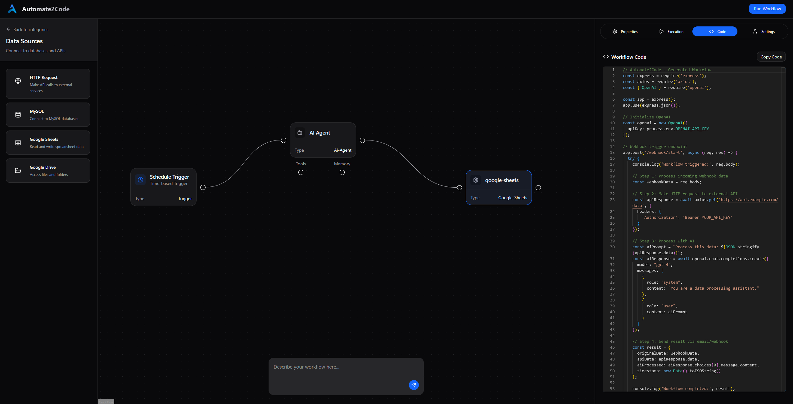

# 🤖 automate2code

### *The Ultimate AI Pipeline Builder for Everyone*

Transform your ideas into production-ready AI applications with zero complexity. Generate complete, deployable code from visual workflows.

WE ARE STILL DEVELOPING THIS PROJECT, IT IS NOT READY YET BUT YOU CAN FOLLOW OUR PROGRESS AND CONTRIBUTE AND CREATE ISSUES AND FEATURE REQUESTS!



---

## 🌟 **What is automate2code?**

automate2code is the bridge between **no-code simplicity** and **full-code power**. Design your AI workflows visually, then get a complete Docker container with production-ready code that you can deploy anywhere.

**Think like all the automation platforms that oblige you to use their tools... but the output is actual code you own and you decide how to use it or where to deploy it.**

---

## 🎯 **Who is this for?**

### 👨‍💻 **Developers**
- Generate boilerplate AI code instantly
- Learn AI development patterns and best practices
- Skip the tedious setup, focus on innovation
- Full control over your code

### 🎓 **Students & Learners**
- Learn by doing with real AI projects
- Understand how AI pipelines work under the hood
- Progress from visual workflows to code mastery
- Perfect for AI education and bootcamps

### 🚀 **Non-Coders**
- Build AI automations without writing code
- Deploy professional applications anywhere
- Learn programming concepts gradually
- No vendor lock-in - you own everything

---

## ✨ **Key Features**

### 🎨 **Visual Pipeline Builder**
- Drag-and-drop interface for creating AI workflows
- Pre-built components for common AI tasks
- Real-time preview of your pipeline

### 🐳 **One-Click Deployment**
- Generate a single Docker file with your complete pipeline
- Deploy to any cloud platform or run locally
- Production-ready code from day one

### 🔧 **Multiple Programming Languages**
- **Currently working on**: Python with LangChain framework is our first focus and more frameworks and languages will follow
- **Coming Soon**: Ollama with Python

### 📚 **Educational Focus**
- Interactive tutorials and examples
- Code explanations for every generated component
- Progressive learning from visual to code

---

## 🚀 **How It Will Work**

```
1. Design → Visual pipeline builder
2. Generate → Production-ready code
3. Deploy → Single Docker container
4. Scale → Anywhere you want
```


## 🎓 **Perfect for Learning**

- **Beginners**: Start with visual workflows, gradually understand the generated code
- **Intermediate**: Customize generated code and learn advanced patterns
- **Advanced**: Use as a rapid prototyping tool and learning reference

---

## 🌍 **Deploy Anywhere**

- ☁️ **Cloud Platforms**: AWS, Google Cloud, Azure
- 💻 **Local Development**: Your laptop, anywhere Docker runs

---

## 🛠️ **Current Status**

| Feature | Status |
|---------|---------|
| Visual Pipeline Builder | 🚧 In Development |
| Python + LangChain Generation | 🚧 In Development |
| Docker Container Output | 🚧 In Development |
| Educational Content | 🚧 In Development |
| Multi-frameworks Support | 📋 Planned |
| Multi-language Support | 📋 Planned |

---

## 🤝 **Contributing**

We're building the future of AI development education and automation. Join us!

- 🐛 **Report Issues**: Found a bug? Let us know!
- 💡 **Feature Requests**: Have an idea? We'd love to hear it!
- 🔧 **Code Contributions**: Help us build something amazing
- 📖 **Documentation**: Help others learn and grow

---

## 🌟 **Why Choose automate2code?**

| Traditional Tools | automate2code |
|------------------|---------------|
| Vendor lock-in | You own the code |
| Black box automation | Full transparency |
| Limited customization | Infinite possibilities |
| No learning value | Educational by design |
| Platform dependent | Deploy anywhere |

---

## Community 
Join us in [discord](https://discord.com/invite/cWfmT7ju) and follow us on GitHub to stay updated, share your ideas, and connect with other AI enthusiasts!

**Ready to transform your AI ideas into reality?** 🚀

*Start building, start learning, start innovating!*
